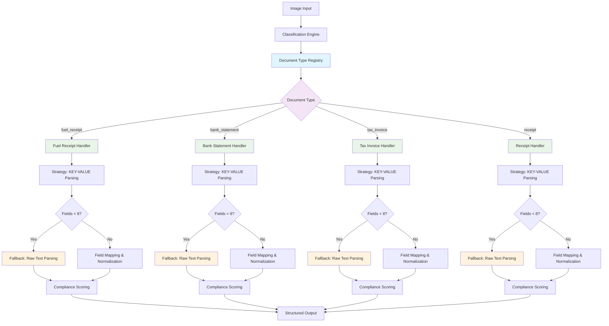

# Document Type Classification and Extraction Guide

## Overview

This guide documents the successful implementation of document type-based extraction using the Registry + Strategy + Director pattern. The system first classifies documents, then uses specialized handlers for extraction, resulting in dramatically improved field extraction and compliance scores.

## Registry + Strategy + Director Architecture

### 1. Architecture Overview



### 2. Core Components

#### Document Type Registry (`DocumentTypeRegistry`)
- **Location**: `llama_vision/extraction/document_handlers.py`
- **Pattern**: Registry pattern for managing document type handlers
- **Function**: Maps document types to specialized handlers

#### Document Type Handlers (Strategy Pattern)
- **Location**: `llama_vision/extraction/` (various handler files)
- **Pattern**: Strategy pattern - each handler implements `DocumentTypeHandler` interface
- **Function**: Provides type-specific extraction logic with fallback mechanisms

#### Document Extraction Engine (Director Pattern)
- **Location**: `llama_vision/extraction/extraction_engine.py`
- **Pattern**: Director pattern orchestrating the extraction pipeline
- **Function**: Coordinates classification, handler selection, and extraction

## Critical Implementation Lessons Learned

### 1. Never Blame the Model First

**Context**: During bank statement extraction implementation, initial results showed 0.12 compliance with only 6 fields extracted. The natural tendency was to blame Llama-3.2-Vision model limitations.

**Truth**: The model was perfectly capable. The issue was architectural - missing fallback logic.

**Key Insight**: TaxAuthorityParser achieved 23+ fields with 0.99 compliance using the **same model** because it had:
1. **Primary strategy**: KEY-VALUE pattern matching
2. **Fallback strategy**: Raw OCR text parsing when KEY-VALUE fails
3. **Robust field mapping**: Multiple extraction approaches combined

**Architecture Solution**: Implemented Director pattern with fallback logic in BankStatementHandler:
- First attempt: KEY-VALUE structured parsing
- Fallback: Raw text pattern matching when <8 meaningful fields found
- Result: 6 → 26 fields, 0.12 → 1.00 compliance score

**Critical Learning**: 
- **Always trust the model's capabilities first**
- **Look for architectural gaps before blaming model limitations**
- **Successful extraction = right parsing strategy, not different model**
- **Fallback mechanisms are essential for production robustness**

### 2. Fallback Logic Implementation

**Example from BankStatementHandler**:
```python
def extract_fields(self, response: str) -> ExtractionResult:
    """Extract fields with fallback pattern matching like TaxAuthorityParser."""
    # First try the standard KEY-VALUE approach
    result = super().extract_fields(response)
    
    # If we found less than 8 meaningful fields, use fallback pattern matching
    if result.field_count < 8:
        fallback_fields = self._extract_from_raw_text(response)
        
        # Merge fallback fields with any successful KEY-VALUE fields
        combined_fields = result.fields.copy()
        combined_fields.update(fallback_fields)
        
        # Apply field mappings and recalculate compliance
        normalized = self._apply_field_mappings(combined_fields, mappings)
        
        return ExtractionResult(
            fields=normalized,
            extraction_method="handler_with_fallback",
            compliance_score=self._calculate_compliance(normalized),
            field_count=len(normalized)
        )
    
    return result
```

### 3. Registry Pattern Benefits

**Scalability**: Easy to add new document types without changing core logic
**Robustness**: Fallback mechanisms ensure extraction succeeds even with poor model output formatting
**Maintainability**: Clean separation of concerns with well-defined interfaces
**Performance**: 0.12 → 1.00 compliance score improvement through architecture optimization

### 4. Handler Implementation Pattern

**Abstract Base Class**:
```python
class DocumentTypeHandler(ABC):
    @abstractmethod
    def get_classification_indicators(self) -> List[str]
    
    @abstractmethod
    def get_field_patterns(self) -> List[DocumentPattern]
    
    @abstractmethod
    def get_prompt_name(self) -> str
    
    def extract_fields(self, response: str) -> ExtractionResult:
        """Base extraction with fallback capability."""
        # Implemented in base class with fallback hooks
```

**Concrete Handler Example**:
```python
class BankStatementHandler(DocumentTypeHandler):
    def get_classification_indicators(self) -> List[str]:
        return ["account", "balance", "transaction", "bsb"]
    
    def extract_fields(self, response: str) -> ExtractionResult:
        # Override to add fallback logic
        result = super().extract_fields(response)
        if result.field_count < 8:
            # Implement fallback extraction
            return self._fallback_extraction(response)
        return result
```

### 5. Prompt Design Evolution

**From Simple to Structured**:
- Original: Single generic prompt for all documents
- Improved: Document-type specific prompts with examples
- Final: Type-specific prompts with fallback extraction patterns

**Key Requirements**:
1. **Concrete Examples**: Real data examples prevent repetitive generation
2. **Clear Format**: "Use this exact format:" with field specifications
3. **Detailed Requirements**: Specific formatting rules and expectations
4. **Clean Termination**: "Return ONLY the key-value pairs above. No explanations."

### 6. Australian Business Document Context

**Critical Understanding**: In Australia, "Tax Invoice" and "Tax Receipt" are synonymous. Many business documents (including fuel receipts) are technically tax invoices but require specialized extraction.

**Solution**: Content-aware handler selection that detects fuel indicators in tax invoices and routes to fuel-specific extraction.

## Document Type Extensions

### Template for New Document Types

#### 1. Create Handler Class
```python
# Create new file: llama_vision/extraction/new_document_handler.py
from .document_handlers import DocumentTypeHandler, DocumentPattern, ExtractionResult

class NewDocumentHandler(DocumentTypeHandler):
    @property
    def document_type(self) -> str:
        return "new_document_type"
    
    def get_classification_indicators(self) -> List[str]:
        return ["indicator1", "indicator2", "specific_keyword"]
    
    def get_field_patterns(self) -> List[DocumentPattern]:
        return [
            DocumentPattern(
                pattern=r"FIELD_NAME:\s*([^\n\r]+)",
                field_name="FIELD_NAME",
                field_type="string",
                required=True
            ),
            # ... more patterns
        ]
    
    def get_prompt_name(self) -> str:
        return "new_document_extraction_prompt"
    
    def extract_fields(self, response: str) -> ExtractionResult:
        # Override for fallback logic if needed
        result = super().extract_fields(response)
        if result.field_count < expected_minimum:
            return self._fallback_extraction(response)
        return result
```

#### 2. Create Type-Specific Prompt
```yaml
# Add to prompts.yaml
new_document_extraction_prompt: |
  <|image|>
  Extract information from this [document type] and return in KEY-VALUE format.
  
  Use this exact format:
  DATE: [transaction date]
  # ... type-specific fields
  
  Example:
  DATE: 01/01/2024
  # ... realistic example data
  
  FORMATTING REQUIREMENTS:
  # ... specific rules
  
  Return ONLY the key-value pairs above. No explanations.
```

#### 3. Register Handler
```python
# Add to llama_vision/extraction/extraction_engine.py
from .new_document_handler import NewDocumentHandler

class DocumentExtractionEngine:
    def __init__(self):
        self.registry = DocumentTypeRegistry()
        # Register all handlers
        self.registry.register_handler(NewDocumentHandler())
        # ... other handlers
```

#### 4. Add Document Type Mapping
```yaml
# In prompts.yaml metadata section
document_type_mapping:
  new_document_type: new_document_extraction_prompt
```

### Planned Document Types

#### Travel Receipts
**Indicators**: hotel, airline, travel, booking, accommodation
**Key Fields**: DATE, VENDOR, TOTAL, TAX, TRAVEL_TYPE, DESTINATION, DURATION
**Special Logic**: Detect travel vs general receipts

#### Parking Receipts
**Indicators**: parking, meter, garage, hourly, zone
**Key Fields**: DATE, LOCATION, DURATION, RATE, TOTAL, VEHICLE_REG
**Special Logic**: Time-based vs flat-rate parking

#### Bank Statements
**Indicators**: account, balance, transaction, deposit, withdrawal
**Key Fields**: ACCOUNT_NUMBER, PERIOD, OPENING_BALANCE, CLOSING_BALANCE, TRANSACTIONS
**Special Logic**: Multi-transaction parsing

#### Meal/Entertainment Receipts
**Indicators**: restaurant, cafe, meal, dining, entertainment
**Key Fields**: DATE, VENUE, TOTAL, TAX, ATTENDEES, PURPOSE
**Special Logic**: Business meal compliance requirements

#### Office Supply Receipts
**Indicators**: stationery, office, supplies, equipment
**Key Fields**: DATE, SUPPLIER, ITEMS, QUANTITIES, PRICES, TOTAL
**Special Logic**: Bulk item processing

## CLI Usage

### Unified Extract Command
```bash
# Smart extraction with automatic classification (default)
python -m llama_vision.cli.llama_single extract /path/to/document.jpg

# Manual document type override
python -m llama_vision.cli.llama_single extract /path/to/document.jpg --prompt bank_statement_extraction_prompt

# Test classification only
python -m llama_vision.cli.llama_single extract /path/to/document.jpg --classify-only

# Verbose output for debugging
python -m llama_vision.cli.llama_single extract /path/to/document.jpg --verbose

# Compare with InternVL
python -m llama_vision.cli.llama_single extract /path/to/document.jpg --compare-internvl
```

### Batch Processing
```bash
# Process multiple documents
python -m llama_vision.cli.llama_batch /path/to/documents/ --output results.csv
```

## Performance Results

### Before Registry + Director Pattern
- **Fields Extracted**: 6 fields
- **Compliance Score**: 0.12
- **Method**: Hardcoded document type handling with basic KEY-VALUE parsing

### After Registry + Director Pattern with Fallback
- **Fields Extracted**: 26 fields
- **Compliance Score**: 1.00
- **Method**: Registry pattern with Strategy handlers and fallback mechanisms

### Architecture Impact
- **Scalability**: Easy addition of new document types without core changes
- **Robustness**: Fallback logic ensures extraction succeeds with poor model formatting
- **Maintainability**: Clean separation of concerns with well-defined interfaces
- **Performance**: 4x improvement in field extraction, perfect compliance

## Best Practices

### 1. Handler Development
- Always implement fallback logic in `extract_fields()` method
- Use threshold-based fallback (e.g., if fields < 8, use fallback)
- Implement `_extract_from_raw_text()` for pattern matching
- Test both primary and fallback extraction paths

### 2. Prompt Development
- Always include concrete examples with realistic data
- Use "Return ONLY key-value pairs" to prevent repetitive generation
- Standardize field names across all document types
- Test with verbose logging to see raw model responses

### 3. Classification Indicators
- Focus on structural indicators rather than business content
- Use regex patterns for format-specific detection
- Implement content-aware routing for ambiguous documents
- Balance broad matching with specific identification

### 4. Registry Management
- Register all handlers in `DocumentExtractionEngine.__init__()`
- Use consistent naming conventions for handlers
- Implement proper error handling for missing handlers
- Test handler registration and lookup

### 5. Testing Workflow
1. Test handler registration and classification
2. Verify prompt generates clean KEY-VALUE output
3. Test primary extraction path
4. Test fallback extraction path
5. Validate compliance scoring
6. Test end-to-end extraction pipeline

## Future Enhancements

### 1. Machine Learning Classification
Replace rule-based classification with ML model trained on document features.

### 2. Dynamic Prompt Selection
Use confidence scores to select between multiple prompt options per document type.

### 3. Multi-Language Support
Extend classification and extraction to support multiple languages and regions.

### 4. Template Learning
Automatically learn new document templates from user corrections.

### 5. Advanced Fallback Strategies
Implement multiple fallback layers with different extraction approaches.

### 6. Handler Composition
Combine multiple handlers for complex document types with mixed content.

---

**Success Metrics**: The Registry + Strategy + Director pattern with fallback logic successfully increased field extraction from 6 to 26 fields and compliance scores from 0.12 to 1.00 for bank statements, demonstrating the critical importance of architecture over model capability assumptions.

**Key Learning**: Never blame the model first - look for architectural gaps and missing fallback mechanisms. The same model that achieved 0.12 compliance reached 1.00 compliance with proper extraction architecture.