# Processing Pipeline Comparison: Mermaid Diagrams

## Single Document Processing Pipelines

### LayoutLM Processing Pipeline

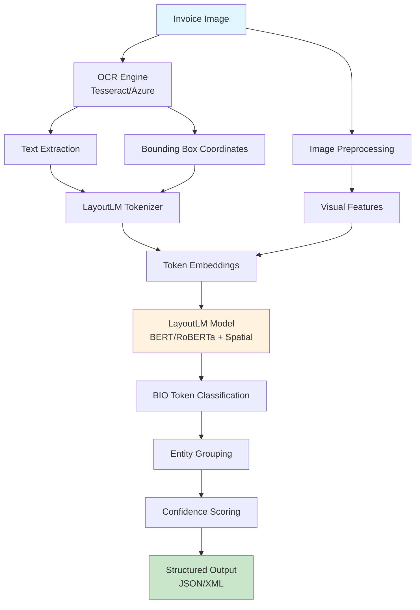

### Llama 3.2 Vision Processing Pipeline

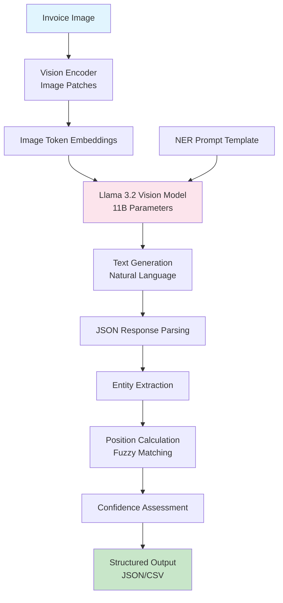

### InternVL Processing Pipeline

```mermaid
graph TD
    A[Invoice Image] --> B[Dynamic Resolution<br/>Adaptive Tiling]
    B --> C[448x448 Tiles]
    C --> D[InternViT-6B<br/>Vision Encoder]
    D --> E[Pixel Unshuffle<br/>1024→256 tokens]
    E --> F[MLP Connector<br/>Vision-Language Alignment]
    F --> G[LLM Decoder<br/>7B Parameters]
    H[Document Prompt] --> G
    G --> I[Structured Generation]
    I --> J[Entity Validation]
    J --> K[Spatial Merging<br/>Tile Overlap Handling]
    K --> L[Confidence Scoring]
    L --> M[Structured Output<br/>JSON/CSV]
    
    style A fill:#e1f5fe
    style M fill:#c8e6c9
    style G fill:#e8f5e8
```

## Multi-Document Processing Pipelines

### LayoutLM Multi-Document Pipeline

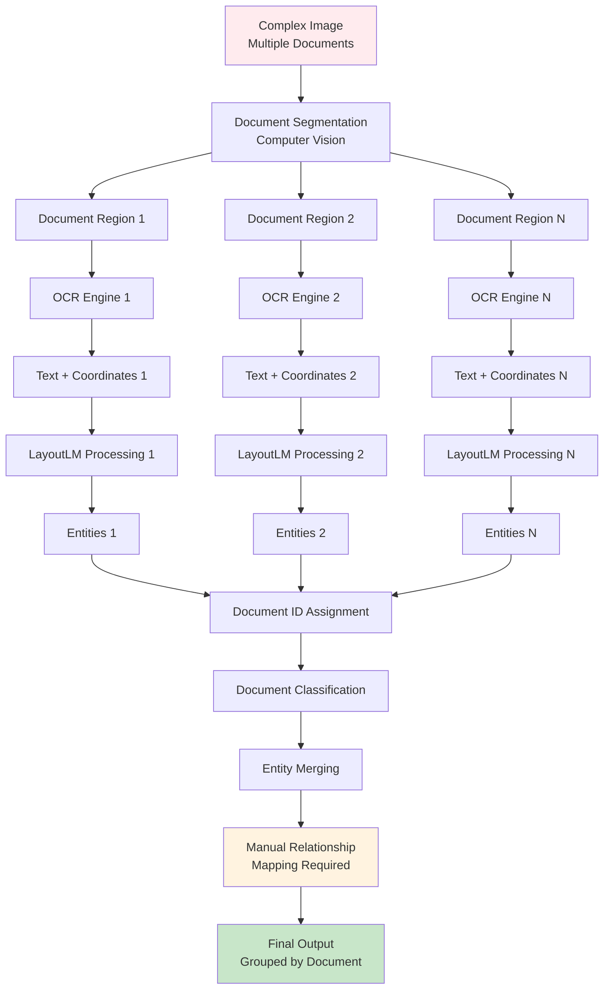

### Llama 3.2 Vision Multi-Document Pipeline

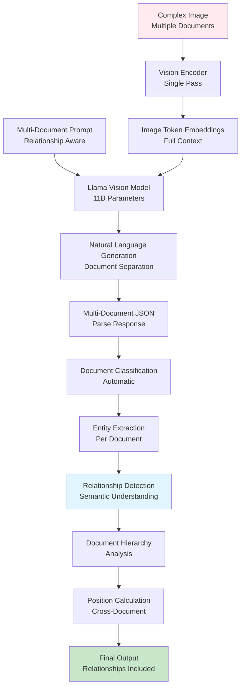

### InternVL Multi-Document Pipeline

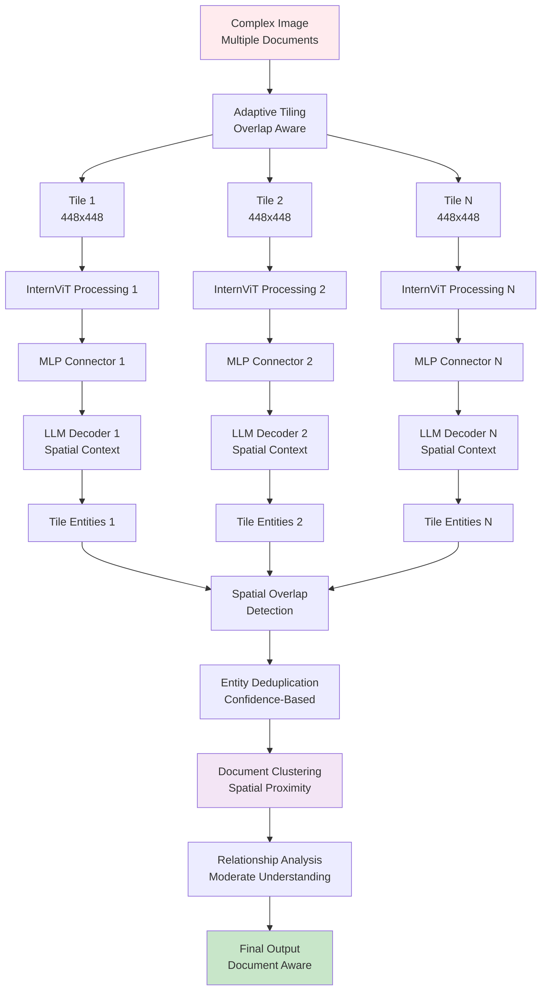

## Performance Comparison Flow

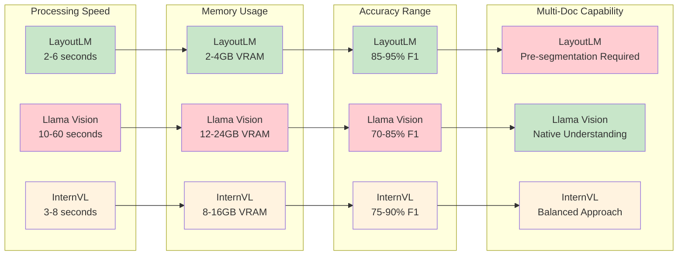

## Use Case Decision Flow

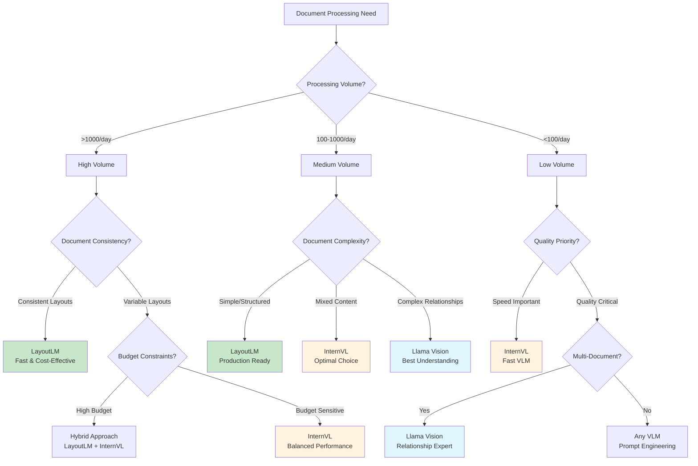

## Architecture Comparison

```mermaid
graph TB
    subgraph "LayoutLM Architecture"
        A1[BERT/RoBERTa Backbone] --> A2[Text Embeddings]
        A1 --> A3[1D Position Embeddings]
        A1 --> A4[2D Spatial Embeddings]
        A1 --> A5[Image Patch Embeddings]
        A2 --> A6[Spatial-Aware Transformer]
        A3 --> A6
        A4 --> A6
        A5 --> A6
        A6 --> A7[BIO Classification Head]
    end
    
    subgraph "Llama Vision Architecture"
        B1[Vision Encoder] --> B2[Image Patch Embeddings]
        B3[Llama 3.2 LLM] --> B4[Text Token Embeddings]
        B2 --> B5[Cross-Modal Attention]
        B4 --> B5
        B5 --> B6[Generative Decoder]
        B6 --> B7[Natural Language Output]
    end
    
    subgraph "InternVL Architecture"
        C1[InternViT-6B] --> C2[High-Res Vision Features]
        C2 --> C3[Pixel Unshuffle<br/>Optimization]
        C3 --> C4[2-Layer MLP<br/>Connector]
        C4 --> C5[LLaMA-7B Decoder]
        C6[Progressive Training<br/>3-Stage] --> C5
        C5 --> C7[Structured Output]
    end
    
    style A6 fill:#fff3e0
    style B5 fill:#fce4ec
    style C4 fill:#e8f5e8
```

## Cost-Benefit Analysis

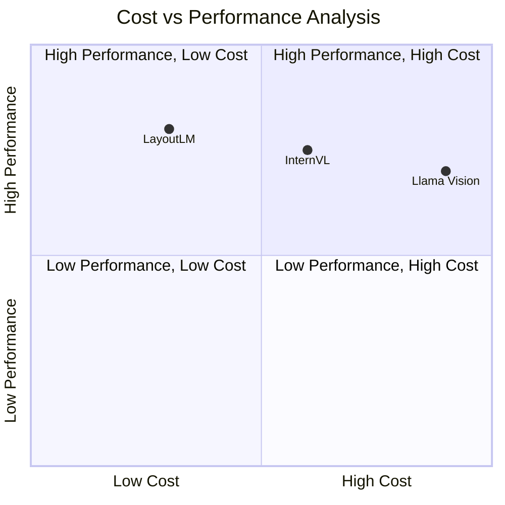

## Technology Evolution Timeline

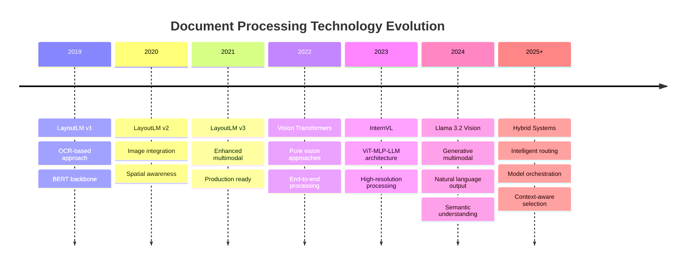